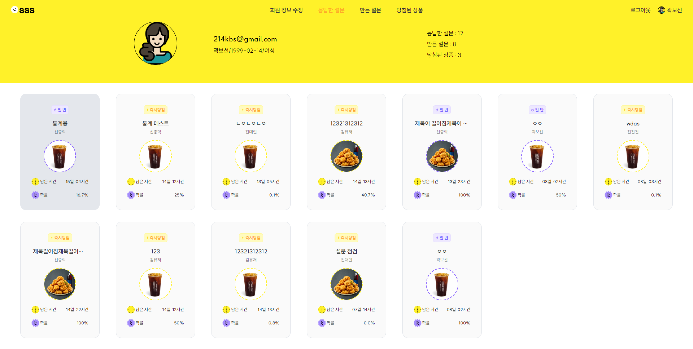

# SSS(Special Survey Service)

## 1. 💻 Developer

|   **Name**   | 박슬빈👑 |  곽보선  | 권선근  |  신종혁  |  전대현  | 최연재  |
| :----------: | :------: | :------: | :-----: | :------: | :------: | :-----: |
| **Position** | BackEnd  | FrontEnd | BackEnd | FrontEnd | FrontEnd | BackEnd |

 

## 2. ✍️ 서비스 소개

SSS는 설문조사 후 투명하고 공정하게 리워드를 지급받는 서비스입니다.
저희는 제작한 설문에 대해 랜덤 알고리즘을 이용하여 당첨자를 추출하도록 하였습니다. 그리고 실시간 로그를 이용하여 당첨자를 투명하게 공개함으로써 모두가 당첨자를 확인할 수 있도록 하였습니다.
 

## 3. 💡 주요 기능

### 설문 목록

<table width="100%">
  <tr>
    <td width="25%">메인 페이지</td>
    <td width="25%">즉시 응답 리스트</td>
    <td width="25%">일반 응답 리스트</td>
    <td width="25%">설문 디테일 페이지</td>
  </tr>
  <tr>
    <td width="25%"> </td>
    <td width="25%"> </td>
    <td width="25%"> </td>
    <td width="25%"> </td>
  </tr>
  <tr>
    <td width="25%">
      <ul>
        <li> 마감 임박 설문, 응답 시간 짧은 설문, 즉시 당첨 설문의 목록을 볼 수 있음</li>
      </ul>
    </td>
    <td>
      <ul>
        <li> 일반 설문, 즉시 당첨 설문의 목록을 볼 수 있음</li>
        <li> 추천순, 확률순, 마감순으로 정렬 가능</li>
      </ul>
    </td>
    <td></td>
    <td>
       <ul>
        <li> 설문에 대한 정보와 링크 공유 가능</li>
        <li> 실시간 당첨자/응답자 로그 확인 가능 </li>
      </ul>
    </td>
    
  </tr>
</table>

### 설문 응답

<table width="100%">
  <tr>
    <td  width="15%"> 설문 응답 페이지 </td>
    <td width="50%"></td>
    <td width="35%">
      <ul>
       <li> 설문 응답 </li>
      </ul>
    </td>
  </tr>
    <tr>
    <td  width="15%"> 실시간 당첨 결과 </td>
    <td width="50%"></td>
    <td width="35%">
      <ul>
       <li> 즉시당첨 type의 경우, 즉시 당첨 여부 확인 </li>
       <li> 복권 긁는 animation </li>
      </ul>
    </td>
  </tr>
</table>

### 설문 제작

<table width="100%">
  <tr>
    <td  width="15%"> 설문 제작 페이지 </td>
    <td width="50%"></td>
    <td width="35%">
      <ul>
       <li>  설문의 대상, 타입 기간을 설정 </li>
       <li>  객관식, 단답형, 시간, 날짜 등 여러 타입의 질문 제작 가능 </li>
      </ul>
    </td>
  </tr>
</table>

### 마이 페이지

- 회원정보 수정, 만든 설문, 응답한 설문, 당첨된 상품을 확인할 수 있는 페이지
<table width="100%">
  <tr>
    <td  width="15%"> 만든/응답한 설문 </td>
    <td width="50%"></td>
    <td width="35%">
      <ul>
       <li>  만든 설문, 응답한 설문 목록 확인 가능 </li>
       <li>  만든 설문 카드 클릭시 통계, 결제 정보 확인 가능 </li>
        <li> 응답한 설문 카드 클릭시, 설문 디테일 페이지처럼 설문 정보 확인 가능</li>
      </ul>
    </td>
  </tr>
  <tr>
    <td  width="15%"> 당첨된 상품 </td>
    <td width="50%"></td>
    <td width="35%">
      <ul>
       <li>  당첨된 상품 목록 </li>
       <li>  당첨 여부를 확인하지 않은 설문은 - 회색 카드  </li>
        <li> 회색 카드 클릭 시 복권 긁기로 당첨 여부 확인 </li>
      </ul>
    </td>
  </tr>
    <tr>
    <td  width="15%"> 통계 페이지 </td>
    <td width="50%"></td>
    <td width="35%">
      <ul>
       <li>  제작한 설문에 대한 응답의 통계 확인 가능 </li>
      </ul>
    </td>
  </tr>
</table>

### 모바일

<table width="100%">
  <tr>
    <td width="25%">메인 페이지</td>
    <td width="25%">디테일(타임어택)</td>
    <td width="25%">디테일(즉시당첨)</td>
  </tr>
  <tr>
    <td width="25%"> </td>
    <td width="25%"> </td>
    <td width="25%"> </td>
  </tr>

  <tr>
    <td width="25%">응답 페이지</td>
    <td width="25%">즉시 당첨 확인 페이지</td>
    <td width="25%">마이페이지</td>
  </tr>
  <tr>
    <td width="25%"> </td>
        <td width="25%"> </td>
    <td width="25%"> </td>
  </tr>
</table>

## 4. ⚙️ 기술 스택

### 프론트엔드

#### 사용 기술 스택

| Next.js(v13.4.8) | React(v18.2.0) | TypeScript(v5.1.6) | Node(v16.20.1) |
| :--------------: | :------------: | :----------------: | :------------: |
|    ![nextjs]     |    ![react]    |       ![ts]        |    ![node]     |

| styled-component(v6.0.8) |          zustand(v4.4.1)          |
| :----------------------: | :-------------------------------: |
|          ![sc]           |  |

#### 개발 환경

| Eslint(v8.2.0) | Prettier(v3.0.0) |
| :------------: | :--------------: |
|   ![eslint]    |   ![prettier]    |

### 백엔드

| Spring Boot(v3.1.1) | MySQL(v8.1) | redis(v3.1.2) |
| :-----------------: | :---------: | :-----------: |
|        ![sb]        |  ![MySQL]   |   ![redis]    |

[nextjs]: /Image/stack/nextjs.svg
[ts]: /Image/stack/typescript.svg
[react]: /Image/stack/react.svg
[node]: /Image/stack/node.svg
[eslint]: /Image/stack/eslint.svg
[prettier]: /Image/stack/prettier-color.svg
[sc]: /Image/stack/styledcomponents-color.svg
[sb]: /Image/stack/springboot-color.svg
[MySQL]: /Image/stack/mysql-color.svg
[redis]: /Image/stack/redis-color.svg

## 5. 📝 참고사항

1. 즉시당첨 설문

- 설문이 끝난 즉시 바로 리워드 당첨 여부를 확인할 수 있다.

2. 일반 설문

- 일반설문은 설문이 끝난 후 추첨번호를 부여받으며 설문이 마감된 후 번호를 추첨하는 알고리즘을 통해 당첨자를 선정하는 방식이며, 마감 기한이 24시간이 남으면 설문 타입명이 일반설문에서 타임어택으로 바뀐다.
